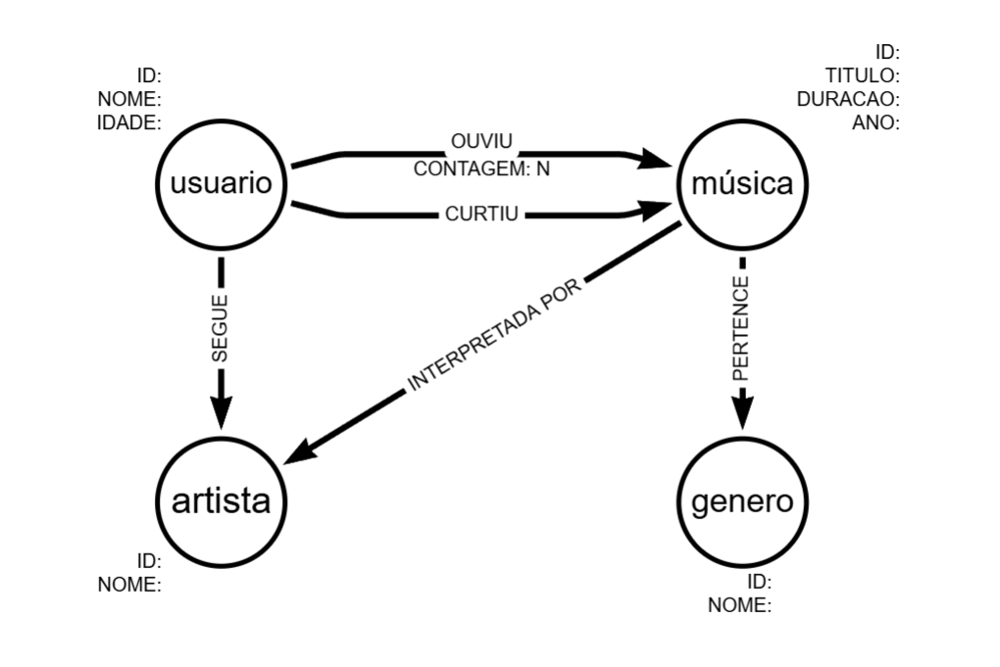

# Sistema de Recomendação de Músicas com Neo4j

Este projeto implementa um sistema de recomendação de músicas utilizando um banco de dados orientado a grafos (Neo4j). O sistema é capaz de sugerir novas faixas com base em filtragem colaborativa (o que outros usuários ouviram), conteúdo (mesmo artista/gênero) e interações sociais (curtidas e seguidores).

## Modelagem do Banco de Dados

Para atingir o objetivo de recomendação personalizada, o banco de dados foi modelado com os seguintes Nós (Entidades) e Relacionamentos (Arestas):



### Nós (Nodes)

* **`(:Usuario)`**: Representa os usuários do sistema. Propriedades: `id`, `nome`, `idade`.
* **`(:Musica)`**: Representa as faixas musicais. Propriedades: `id`, `titulo`, `duracao`, `ano`.
* **`(:Artista)`**: Representa os intérpretes. Propriedades: `id`, `nome`.
* **`(:Genero)`**: Representa os gêneros musicais. Propriedades: `id`, `nome`.

### Relacionamentos (Relationships)

* **`(:Usuario)-[:OUVIU {contagem: N}]->(:Musica)`**: Indica que um usuário ouviu uma música. A propriedade `contagem` armazena quantas vezes.
* **`(:Usuario)-[:CURTIU]->(:Musica)`**: Indica uma preferência explícita (like) do usuário por uma música.
* **`(:Usuario)-[:SEGUE]->(:Artista)`**: Indica que o usuário segue um artista, demonstrando interesse em suas obras.
* **`(:Musica)-[:INTERPRETADA_POR]->(:Artista)`**: Conecta a música ao seu criador.
* **`(:Musica)-[:PERTENCE_A]->(:Genero)`**: Classifica a música em um gênero.

### Estratégia de Recomendação

O sistema utiliza uma abordagem híbrida ponderada para sugerir músicas. Ao buscar recomendações para uma música ou usuário, o algoritmo Cypher calcula uma pontuação (`score`) somando:

1. **Similaridade de Artista**: +3 pontos se for do mesmo artista.
2. **Similaridade de Gênero**: +1 ponto se for do mesmo gênero.
3. **Filtragem Colaborativa (Audições)**: +1 ponto para cada outro usuário que também ouviu a música candidata.
4. **Filtragem Colaborativa (Curtidas)**: +3 pontos para cada outro usuário que curtiu a música candidata (sinal mais forte).
5. **Interesse Explícito**: +5 pontos se o usuário alvo segue o artista da música candidata.

---

## Estrutura do Projeto

- `scripts/generate_real_data.py`: Script Python que busca dados reais da API do iTunes para criar o dataset.
- `scripts/import_data.cypher`: Scripts para criar o esquema e importar dados no Neo4j.
- `scripts/recommendation_queries.cypher`: Consultas prontas para testar as recomendações.
- `data/`: Diretório onde os arquivos CSV são gerados.

## Passo a Passo

### 1. Gerar os Dados

Certifique-se de ter o Python instalado. Execute o script para baixar dados reais:

```bash
python scripts/generate_real_data.py
```

*Nota: Este script faz chamadas à API do iTunes e pode levar alguns minutos para baixar 50.000 músicas.*

Isso criará os arquivos CSV na pasta `data/`, incluindo um arquivo especial para facilitar a busca de IDs:

- `musicas_ids.csv`: Contém apenas `id` e `titulo` das músicas. Use este arquivo para encontrar o ID de uma música específica ("Song_Title_X") para usar nas consultas.

### 2. Importar para o Neo4j

1. Copie todos os arquivos `.csv` da pasta `data/` para a pasta `import/` do seu banco de dados Neo4j.
2. Abra o Neo4j Browser ou Cypher Shell.
3. Execute os comandos do arquivo `scripts/import_data.cypher`.

### 3. Gerar Recomendações

Utilize as consultas no arquivo `scripts/recommendation_queries.cypher`.

**Dica:** Abra o arquivo `data/musicas_ids.csv` para escolher um ID de música para testar.

Exemplo:

```cypher
// Defina o ID da música base (ex: ID 500)
:param musicaId => 500
```

Em seguida, execute a consulta de recomendação para ver as sugestões. A próxima musica a ser tocada seria a primeira a ser exibida como resultado:

<!-- adicionar os codigos abaixo das recomendações-->
```bash
recomendação a partir de usuarios ( se usuario escutou musica e também ouviou outra várias vezes esta outra musica será tocada em seguida):
MATCH (alvo:Musica {id: $musicaId})<-[:OUVIU]-(u:Usuario)-[:OUVIU]->(rec:Musica)
WHERE rec.id <> alvo.id
RETURN rec.titulo, rec.id, count(u) AS ouvintes_comuns
ORDER BY ouvintes_comuns DESC
LIMIT 10;
```

```bash
recomendação a partir do mesmo artista (se a musica é de um artista, a próxima também será):
MATCH (alvo:Musica {id: $musicaId})-[:INTERPRETADA_POR]->(a:Artista)<-[:INTERPRETADA_POR]-(rec:Musica)
WHERE rec.id <> alvo.id
RETURN rec.titulo, a.nome AS artista
LIMIT 10;
```

```bash
recomendação a partir do gênero (Aleatório ou Popular):
MATCH (alvo:Musica {id: $musicaId})-[:PERTENCE_A]->(g:Genero)<-[:PERTENCE_A]-(rec:Musica)
WHERE rec.id <> alvo.id
RETURN rec.titulo, g.nome AS genero
LIMIT 10;
```

```bash
recomendação híbrida avançada (média ponderada):
MATCH (alvo:Musica {id: $musicaId})
// Encontrar candidatos potenciais (limitar espaço de busca se necessário)
MATCH (candidata:Musica)
WHERE candidata.id <> alvo.id

// Calcular Pontuação de Artista
OPTIONAL MATCH (alvo)-[:INTERPRETADA_POR]->(a:Artista)<-[:INTERPRETADA_POR]-(candidata)
WITH alvo, candidata, CASE WHEN a IS NOT NULL THEN 3 ELSE 0 END AS pontuacao_artista

// Calcular Pontuação de Gênero
OPTIONAL MATCH (alvo)-[:PERTENCE_A]->(g:Genero)<-[:PERTENCE_A]-(candidata)
WITH alvo, candidata, pontuacao_artista, CASE WHEN g IS NOT NULL THEN 1 ELSE 0 END AS pontuacao_genero

// Calcular Pontuação Social (Colaborativa - Audições)
OPTIONAL MATCH (alvo)<-[:OUVIU]-(u:Usuario)-[:OUVIU]->(candidata)
WITH alvo, candidata, pontuacao_artista, pontuacao_genero, count(u) * 1 AS pontuacao_audicao

// Calcular Pontuação Social (Colaborativa - Curtidas)
OPTIONAL MATCH (alvo)<-[:CURTIU]-(u2:Usuario)-[:CURTIU]->(candidata)
WITH alvo, candidata, pontuacao_artista, pontuacao_genero, pontuacao_audicao, count(u2) * 3 AS pontuacao_curtida

WITH candidata, (pontuacao_artista + pontuacao_genero + pontuacao_audicao + pontuacao_curtida) AS pontuacao_total
WHERE pontuacao_total > 0
RETURN candidata.titulo, candidata.id, pontuacao_total
ORDER BY pontuacao_total DESC
LIMIT 10;
```

```bash
recomendação personalizada (se usuario curtiu a musica de mesmo artista e/ou genero, ela tocará em seguida, excluindo a já tocada anteriormente):
MATCH (u:Usuario {id: $usuarioId})
MATCH (candidata:Musica)
WHERE NOT (u)-[:OUVIU]->(candidata)

// Pontuação baseada em artistas seguidos
OPTIONAL MATCH (u)-[:SEGUE]->(a:Artista)<-[:INTERPRETADA_POR]-(candidata)
WITH u, candidata, CASE WHEN a IS NOT NULL THEN 10 ELSE 0 END AS pontuacao_segue

// Pontuação baseada no gênero das músicas que curtiram
OPTIONAL MATCH (u)-[:CURTIU]->(:Musica)-[:PERTENCE_A]->(g:Genero)<-[:PERTENCE_A]-(candidata)
WITH u, candidata, pontuacao_segue, count(g) * 2 AS afinidade_genero

WITH candidata, (pontuacao_segue + afinidade_genero) AS pontuacao_total
WHERE pontuacao_total > 0
RETURN candidata.titulo, pontuacao_total
ORDER BY pontuacao_total DESC
LIMIT 10;
```

Conclusão:
Baseado nas consultas acima, você pode implementar um sistema de recomendação robusto que sugere músicas relevantes para os usuários com base em seus hábitos de escuta, preferências e conexões sociais. A modelagem do grafo e as consultas Cypher fornecem uma base sólida para expandir e refinar o sistema conforme necessário. 
Tamém é possível integrar com uma aplicação front-end para uma experiência de usuário completa. Esta implementação serve como um ponto de partida para explorar recomendações musicais usando bancos de dados de grafos, e não apenas relacionamentos tradicionais de bancos de dados relacionais.
Aproveite a exploração musical!🎵